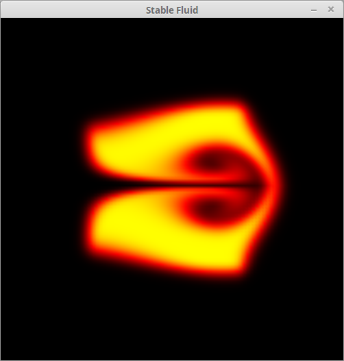
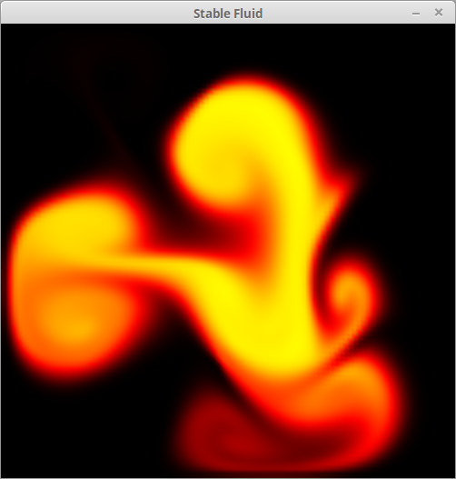
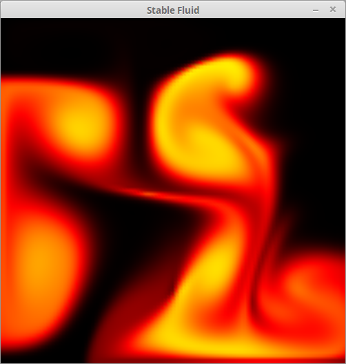
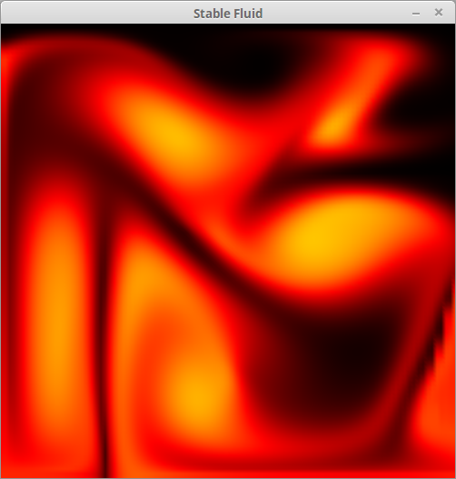

# navier-stokes-cpu
Fluid simulation by solving 2D Navier-Stokes equations on CPU.
C++, SFML 2.3.2, OpenGL 3+, glm.

This is a very old project of mine, monothreaded for now.

I am currently updating this project and two versions are in the works:
 - multi-threaded version using OpenMP
 - full GPU version using OpenCL

# Interface
You can add density with left mouse button and apply a force by moving the mouse
while holding right mouse button.

# Screenshots

Here are a bunch a screenshots: (density plot)

# Credit
This project is base on this excellent article:
http://www.intpowertechcorp.com/GDC03.pdf
